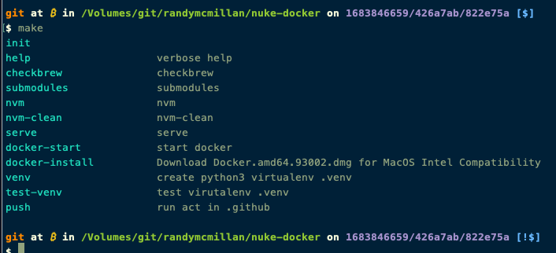

# Getting Started with [Fastify-CLI](https://www.npmjs.com/package/fastify-cli)
This project was bootstrapped with Fastify-CLI.

## Available Scripts

In the project directory, you can run:

### `npm run dev`

To start the app in dev mode.\
Open [http://localhost:3000](http://localhost:3000) to view it in the browser.

### `npm start`

For production mode

### `npm run test`

Run the test cases.

## Learn More

To learn Fastify, check out the [Fastify documentation](https://www.fastify.io/docs/latest/).

===


### "act in act" like "docker in docker"

1. [Install act CI](https://github.com/nektos/act#installation)

	$`curl -s https://raw.githubusercontent.com/nektos/act/master/install.sh | sudo bash`

2. Install `make`

	$`brew install make`
or
	$`apt install make`

3. clone repo

	$`git clone https://github.com/RandyMcMillan/nuke-docker.git`

	$`cd nuke-docker`

4. $`make`



5. $`make push`

https://github.com/RandyMcMillan/nuke-docker/assets/152159/dac1cdef-bec4-4b76-8f2d-c304de680b44

---

### act example

```
act -v   -W .github/workflows/push.yml
act -vr  -W .github/workflows/push.yml
act -vrb -W .github/workflows/push.yml
```
